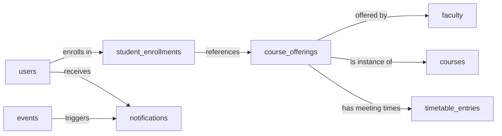

# 🎓 Smart Campus Assistant

**A Complete Campus Management Solution for Students & Administrators**

[](https://openjdk.org/)
[](https://spring.io/projects/spring-boot)
[](https://www.mysql.com/)
[](https://jwt.io/)

Smart Campus Assistant is a full-stack web application designed to streamline campus life for both students and administrators. It provides personalized dashboards, smart timetable management, course enrollment, events, file management, and real-time notifications with secure JWT-based authentication.

---

## 🚀 Features

### Core Features
- 🔐 **JWT Authentication** - Secure stateless authentication with role-based access control
- 📊 **Personalized Dashboards** - Real-time analytics and quick actions
- 📅 **Smart Timetable** - Weekly schedule view with conflict detection
- 📚 **Course Enrollment** - Browse offerings, enroll/drop with capacity management
- 🎯 **Event Management** - Campus events and announcements
- 📢 **Notification System** - Real-time updates and alerts
- 👨‍🏫 **Faculty Directory** - Comprehensive faculty profiles
- 🎛️ **Admin Panel** - Complete CRUD operations for all entities

### Advanced Features (PRD Compliant)
- 📄 **Pagination & Sorting** - Efficient data retrieval with sorting options
- 📁 **File Upload/Download** - Secure file management system
- 📧 **Email Notifications** - SMTP-based email integration
- 🌤️ **Weather API Integration** - Campus weather information via OpenWeatherMap
- ⚡ **Caching** - Performance optimization with Spring Cache
- 🚦 **Rate Limiting** - API protection (100 requests/minute per IP)
- 📝 **Input Validation** - Jakarta Bean Validation
- 📖 **Swagger Documentation** - Interactive API documentation
- 🛡️ **Global Exception Handling** - Consistent error responses

---

## 🛠️ Tech Stack

| Layer | Technology |
|-------|------------|
| **Backend** | Java 24, Spring Boot 3.4.12, Spring Security 6 |
| **Authentication** | JWT (jjwt 0.12.3) |
| **Database** | MySQL 8.0, Flyway Migrations |
| **ORM** | JPA/Hibernate 6 |
| **Frontend** | Thymeleaf 3.1.3, Bootstrap 5.3 |
| **API Docs** | Swagger/OpenAPI (springdoc 2.3.0) |
| **Caching** | Spring Cache (ConcurrentMapCache) |
| **Build** | Maven |

---

## 📦 Project Structure

```
src/main/java/com/sca/smartcampusbackend/
├── config/           # Security, Cache, OpenAPI configuration
├── controller/       # REST controllers & page controllers
│   └── api/          # API-only controllers (Files, Integrations)
├── dto/              # Request/Response DTOs
├── entity/           # JPA entities
├── exception/        # Custom exceptions & global handler
├── repository/       # Spring Data JPA repositories
├── security/         # JWT utilities, filters, auth components
└── service/          # Business logic & external integrations
    ├── impl/         # Service implementations
    └── external/     # Weather API service
```

---

## 🌐 API Endpoints

### Authentication
| Method | Endpoint | Description |
|--------|----------|-------------|
| POST | `/api/auth/login` | Login and get JWT token |

### Courses (with Pagination)
| Method | Endpoint | Description |
|--------|----------|-------------|
| GET | `/api/courses/paginated?page=0&size=10&sortBy=title` | Paginated list |
| GET | `/api/courses/search?q=programming` | Search by title |
| GET | `/api/courses/{id}` | Get by ID |
| POST | `/api/courses` | Create (Admin) |
| PUT | `/api/courses/{id}` | Update (Admin) |
| DELETE | `/api/courses/{id}` | Delete (Admin) |

### File Management
| Method | Endpoint | Description |
|--------|----------|-------------|
| POST | `/api/files/upload` | Upload single file |
| POST | `/api/files/upload-multiple` | Upload multiple files |
| GET | `/api/files/download/{filename}` | Download file |
| DELETE | `/api/files/{filename}` | Delete file (Admin) |

### External Integrations
| Method | Endpoint | Description |
|--------|----------|-------------|
| GET | `/api/integrations/weather` | Campus weather |
| GET | `/api/integrations/weather/{city}` | Weather by city |
| POST | `/api/integrations/email/test` | Test email (Admin) |
| POST | `/api/integrations/email/notify` | Send notification |

📖 **Full API Documentation**: http://localhost:8080/swagger-ui.html

---

## 🚀 Getting Started

### Prerequisites
- Java JDK 24
- Maven 3.8+
- MySQL 8.0+

### Quick Setup

```bash
# 1. Clone repository
git clone <your-repository-url>
cd SmartCampus

# 2. Configure database (see Configuration section below)

# 3. Build and run
./mvnw clean install
./mvnw spring-boot:run

# 4. Access application
# Web UI: http://localhost:8080/login
# Swagger: http://localhost:8080/swagger-ui.html
```

### Test Credentials
- **Admin**: admin / password
- **Student**: student / password

---

## ⚙️ Configuration

All configuration is in `src/main/resources/application.properties`:

### Database
```properties
spring.datasource.url=jdbc:mysql://your-host:3306/smart_campus
spring.datasource.username=your-username
spring.datasource.password=your-password
```

### JWT
```properties
jwt.secret=<your-base64-encoded-secret>
jwt.expiration=86400000
```

### Email (Optional)
```properties
app.email.enabled=true
spring.mail.host=smtp.gmail.com
spring.mail.port=587
spring.mail.username=your-email@gmail.com
spring.mail.password=your-app-password
```

### Weather API (Optional)
```properties
weather.api.key=your-openweathermap-api-key
weather.default.city=Your-City
```

---

## 📊 Database Schema

**Core Tables**: users, faculty, courses, course_offerings, student_enrollments, timetable_entries, events, notifications



---

## 🧪 Testing the APIs

### Using Swagger UI
1. Open http://localhost:8080/swagger-ui.html
2. Click "Authorize" and enter JWT token
3. Test any endpoint

### Using cURL
```bash
# Get JWT Token
curl -X POST http://localhost:8080/api/auth/login \
  -H "Content-Type: application/json" \
  -d '{"username":"admin","password":"password"}'

# Use token in subsequent requests
curl http://localhost:8080/api/courses/paginated \
  -H "Authorization: Bearer <your-token>"
```

---

## 📁 File Upload

Files are stored in the `uploads/` directory (configurable via `file.upload-dir`).

**Supported**: All file types up to 10MB

---

## 🐛 Troubleshooting

| Issue | Solution |
|-------|----------|
| Application fails to start | Check database connection in application.properties |
| 401 Unauthorized | Verify JWT token is valid and not expired |
| 429 Too Many Requests | Rate limit exceeded (100 req/min), wait and retry |
| Email not sending | Set `app.email.enabled=true` and configure SMTP |
| Weather API errors | Get API key from openweathermap.org |

---
