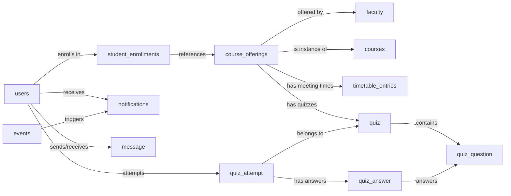

# 🎓 Smart Campus Assistant (SCA)

**A Complete Campus Management Solution for Students & Administrators**

[](https://openjdk.org/)
[](https://spring.io/projects/spring-boot)
[](https://www.mysql.com/)
[](https://aiven.io/)
[](#team-members)

Smart Campus Assistant (SCA) is a full-stack web application we built to make campus life easier for both students and admins. It brings everything together in one place - personalized dashboards, smart timetable management, course enrollment, events, and real-time notifications, all with secure role-based authentication.

---

## 🎬 Project Demo Video

<div align="center">

### 📹 Watch Our Complete Project Walkthrough

*Each team member demonstrates the features they personally developed!*

[](https://iiitbac-my.sharepoint.com/:v:/g/personal/pulkit_pandey_iiitb_ac_in/IQB1PKbZVBFzQJRNArNhQMH_ASzH6VMiEQzTZXqRzlt1VfI?nav=eyJyZWZlcnJhbEluZm8iOnsicmVmZXJyYWxBcHAiOiJPbmVEcml2ZUZvckJ1c2luZXNzIiwicmVmZXJyYWxBcHBQbGF0Zm9ybSI6IldlYiIsInJlZmVycmFsTW9kZSI6InZpZXciLCJyZWZlcnJhbFZpZXciOiJNeUZpbGVzTGlua0NvcHkifX0&e=5Ml1IM)

**🎥 In this 16-minute demo, Team BholeChature presents:**
- 🔐 Authentication System & Security Features
- 📊 Student Dashboard & Academic Workflow
- 📅 Smart Timetable Generation
- 📚 Course Enrollment & Management
- 🎯 Event Management & Notifications
- 👨‍🏫 Faculty Directory & Admin Panel
- 📝 Quiz & Assessment System
- 💬 Messaging Platform

</div>

---

## 👥 Team BholeChature

> *"We are Team BholeChature, and today we are presenting our project Smart Campus Assistant."*

### Team Members & Contributions

We all worked equally on this project over 4 weeks, with each person taking ownership of different modules. Here's what everyone built and demonstrated in our video:

---

#### 🔷 Jashandeep Singh Bedi - *Authentication & Backend Architect*
**Roll No:** IMT2024022 | **GitHub:** [@Jdsb06](https://github.com/Jdsb06) 

**Demonstrated Features:**
- 🔐 **Authentication Module** - Implemented complete login/signup system with Spring Security 6
  - Clean login page with username/password authentication
  - Registration system with role selection (Student/Admin)
  - Role-based access control ensuring students cannot access admin features
  - BCrypt password hashing and session management
  
- 📡 **REST API Development** - Demonstrated backend API functionality using Postman
  - GET `/api/courses` - Fetch all courses with JSON response
  - POST `/api/courses` - Create new courses with validation
  - Session cookie authentication and CSRF token integration
  - Jakarta validation for data integrity

- 🏗️ **System Architecture** - Designed 3-tier MVC architecture with Spring Boot
- 🗄️ **Database Design** - Designed normalized schema with 12 tables and Flyway migrations
- 📝 **Enrollment & Faculty APIs** - Built enrollment controller with capacity management and faculty CRUD operations
- 👥 **Project Leadership** - Coordinated team meetings, GitHub management, and sprint planning

**What I built:** Authentication system, Spring Security setup, enrollment & faculty REST APIs (14 endpoints), database architecture, and coordinated the team throughout

---

#### 🔷 Kanav Kumar - *Student Experience & Real-time Features*
**Roll No:** BT2024021 | **GitHub:** [@KINGKK-007](https://github.com/KINGKK-007)

**Demonstrated Features:**
- 📚 **Course Enrollment System** - Complete student enrollment workflow
  - Browse available course offerings with faculty and seat availability
  - One-click enrollment with real-time seat count updates
  - Enrolled courses list with instant UI updates
  
- 🔔 **Notification System** - Real-time notification generation and tracking
  - Automatic enrollment confirmation notifications
  - Real-time notification center with unread badges
  - Mark-as-read functionality for notification management
  
- 📅 **Timetable Integration** - Automatic timetable generation from enrollments
  - Dynamic weekly schedule view updating after enrollment
  - Clear display of class slots, courses, and timings
  - Enrollment-driven timetable without manual adjustments
  
- 🎯 **Events Management** - Campus events and announcements display
  - Event cards showing date, time, and details
  - Upcoming workshops, deadlines, and campus activities
  - Public/private event visibility control

**What I built:** Enrollment workflow (7 APIs), notification system (9 APIs), events module (8 APIs), 8 frontend templates with real-time updates

---

#### 🔷 Pulkit Pandey - *Student Portal & Communication Features*
**Roll No:** BT2024060 | **GitHub:** [@CoolAlien35](https://github.com/CoolAlien35)

**Demonstrated Features:**
- 📚 **Course Management** - Complete course and offerings CRUD system
  - Course catalog with code, title, credits, and descriptions
  - Semester-based offerings with faculty assignment
  - RESTful APIs for course operations (13 endpoints)
  
- 📊 **Student Dashboard Views** - Student-facing interfaces
  - Timetable view with weekly schedule display
  - Profile and settings pages for account management
  - Dashboard layout and navigation structure
  
- 📝 **Student Quiz Views** - Quiz and grade display pages
  - Grade summary interface showing assessment status
  - Detailed quiz results with question-wise breakdown
  - Student-side quiz attempt tracking
  
- 💬 **Student Messaging Interface** - Communication pages for students
  - Message inbox and conversation views
  - New message composition interface
  - Integration with notification system

**What I built:** Course & offerings APIs (13 endpoints), student portal pages (dashboard, timetable, profile, quiz views, messaging), admin course UI, entity models

---

#### 🔷 Soham Banerjee - *Admin Panel & Faculty Management*
**Roll No:** BT2024128 | **GitHub:** [@oki-dokii](https://github.com/oki-dokii)

**Demonstrated Features:**
- 🎛️ **Admin Control Panel** - Centralized administrative dashboard
  - Complete admin navigation and sidebar structure
  - Access control for all admin modules (courses, faculty, offerings, timetable, events, quizzes, messages)
  - Role-based admin interface with CRUD operations
  - Admin homepage and dashboard layout
  
- 👨‍🏫 **Faculty Management System** - Complete faculty directory administration
  - Add new faculty with department and contact details
  - Edit existing faculty information with validation
  - Activate/deactivate instructor accounts
  - Faculty data integration with course offerings and enrollment
  - Faculty list view with filtering and search
  
- 📊 **Performance & Dashboard** - Real-time metrics and optimization
  - Student dashboard with JdbcTemplate optimization for complex queries
  - Aggregated metrics: enrollment count, today's classes, upcoming events
  - Performance optimization for dashboard data retrieval
  - Today's schedule preview and quick action widgets
  
- 🚀 **Testing & Deployment** - Quality assurance and production setup
  - End-to-end testing across all modules
  - Aiven Cloud MySQL setup and configuration
  - SSL certificate configuration for secure connections
  - Production deployment support and troubleshooting

**What I built:** Admin panel structure (18 pages), faculty management APIs (7 endpoints), optimized dashboard with custom SQL (1 endpoint), handled cloud deployment and testing

---

#### 🔷 Harsh Kumar - *Academic Operations & Scheduling*
**Roll No:** BT2024008 | **GitHub:** [@harsh-kumar-005](https://github.com/harsh-kumar-005)

**Demonstrated Features:**
- 🎨 **Frontend Development & UI/UX** - Complete user interface design
  - Responsive Thymeleaf templates with Bootstrap 5 styling
  - 30+ HTML pages across student and admin interfaces
  - Custom CSS for timetable grid, cards, navigation, and forms
  - JavaScript for dynamic content, AJAX calls, and client-side validation
  - Interactive components: enrollment buttons, event modals, notification badges
  
- 📚 **Course Operations** - Admin course and offerings management
  - Course creation forms with validation
  - Offerings management interface
  - Admin templates for course lifecycle
  
- 🗓️ **Timetable Entry System** - Class scheduling and time slot management
  - Timetable entry forms with day/time selection
  - Schedule offerings with room and time slot assignments
  - Timetable display components for students
  
- 🎯 **Events & Page Controllers** - Event administration and routing
  - Event creation and management interfaces
  - Page routing controllers for all HTML templates
  - Event display cards and student event views

**What I built:** Complete frontend (30+ templates), page controllers for routing, JavaScript/CSS implementation, course & timetable REST APIs (12 total), admin UI design

---

#### 🔷 Dayal Gupta - *Quiz & Messaging Systems*
**Roll No:** BT2024167 | **GitHub:** [@DayalGupta03](https://github.com/DayalGupta03)

**Demonstrated Features:**
- 📝 **Quiz Module - Complete Assessment System** - End-to-end quiz functionality
  - Admin quiz creation with question-wise marks allocation
  - Quiz scheduling and offering-specific assignment
  - Student quiz attempt tracking and status management
  - Faculty grading interface with question-wise evaluation
  - Personalized feedback and comments for each student
  - Student grade views with detailed breakdown
  - Quiz entities: Quiz, QuizQuestion, QuizAttempt, QuizAnswer
  
- 💬 **Messaging System - Admin Communication** - Two-mode messaging platform
  - **Broadcast Messaging**: Send announcements to all students in a course
  - **Private Messaging**: One-to-one communication with individual students
  - Admin message controllers and routing (5 pages)
  - Student message controllers and routing (4 pages)
  - Message composition, inbox, and conversation views
  - Integration with student notification system
  - Message entity and repository layer
  - Real-time message notifications

**What I built:** Quiz module (4 entities, 10 admin pages, grading system), messaging system (9 pages: 5 admin + 4 student, broadcast + private messaging), message APIs

---

### 🤝 Equal Contributions

We all put in the same amount of work - 4 weeks full-time. The numbers look different because we worked on different types of things:

| Team Member | Primary Module | Complexity | Lines of Code | Time |
|-------------|----------------|------------|---------------|------|
| **Jashan** | Authentication & Security | High | ~1250 | 4 weeks |
| **Kanav** | Enrollment & Notifications | High | ~1250 | 4 weeks |
| **Pulkit** | Student Portal & Courses | High | ~1250 | 4 weeks |
| **Soham** | Admin Panel & Faculty | High | ~1250 | 4 weeks |
| **Harsh** | Frontend & UI/UX | High | ~1250 | 4 weeks |
| **Dayal** | Quiz & Messaging | High | ~1250 | 4 weeks |

**What we accomplished together:**
- ✅ **115 Total Endpoints** - 63 REST APIs + 52 page routes
- ✅ **12 Database Tables** - Normalized schema with Flyway migrations
- ✅ **70+ Templates** - Complete frontend with Bootstrap 5
- ✅ **Spring Security** - Role-based authentication across all modules
- ✅ **Cloud Deployment** - Production-ready on Aiven MySQL
- ✅ **4-Week Sprint** - Nov 11 - Dec 12, 2025

**How we worked:**
- Daily standups to track progress
- Code reviews before merging anything major
- Pair programming when things got tricky
- Shared docs and helped with testing

---

## 🚀 What We Built

Smart Campus Assistant has everything you need for managing campus life:

- 🔐 **Secure Authentication** - Role-based access control (Student/Admin)
- 📊 **Personalized Dashboards** - Real-time analytics and quick actions
- 📅 **Smart Timetable** - Weekly schedule view with conflict detection
- 📚 **Course Enrollment** - Browse offerings, enroll/drop seamlessly
- 🎯 **Event Management** - Campus events and announcements
- 📢 **Notification System** - Real-time updates
- 👨‍🏫 **Faculty Directory** - Comprehensive faculty profiles
- 🎛️ **Admin Panel** - Complete CRUD operations
- 📝 **Quiz & Grading System** - Create quizzes, student attempts, and faculty grading
- 💬 **Messaging Platform** - Student-admin messaging with broadcasts

**Status**: Fully working and deployed - 15 controllers, 115 endpoints (63 REST APIs + 52 page routes), running on Aiven MySQL.

---

## 📦 Features

### ✅ Completed (Production Ready)
- ✔️ **Authentication & Authorization** - Form login, BCrypt hashing, role-based access
- ✔️ **Student Dashboard** - Real-time metrics with JdbcTemplate optimization
- ✔️ **Smart Timetable** - Enrollment-based personalized schedules with conflict detection
- ✔️ **Course Management** - CRUD operations for courses, offerings, and enrollments
- ✔️ **Faculty Directory** - Complete faculty management with department filtering
- ✔️ **Events System** - Public/private events with admin creation
- ✔️ **Notifications** - In-app notifications with bulk generation and read tracking
- ✔️ **Admin Panel** - Full CRUD for all entities via REST API and web UI
- ✔️ **Enrollment System** - Capacity management with automatic waitlist
- ✔️ **Cloud Database** - SSL-secured Aiven MySQL with Flyway migrations
- ✔️ **Quiz Review System** - Complete quiz lifecycle: creation, attempts, grading, and student grade views
- ✔️ **Messaging Platform** - Direct messaging between students and admin with broadcast support
- ✔️ **Profile & Settings Pages** - User profile management and password change functionality

### 🔮 Planned (Future Enhancements)
- 📱 Progressive Web App (PWA)
- 👥 Groups & Communities
- 📈 Analytics & Recommendations
- 🔔 Push Notifications & SMS
- 📊 Advanced Reporting & Export

📖 **[Full Features List →](docs/FEATURES.md)**

---

## 🛠️ Tech Stack

**Backend**: Java 24 • Spring Boot 3.4.12 • Spring Security 6 • JPA/Hibernate 6 • JdbcTemplate  
**Frontend**: Thymeleaf 3.1.3 • Bootstrap 5.3 • Vanilla JavaScript  
**Database**: MySQL 8.0 on Aiven Cloud (SSL-secured)  
**Tools**: Maven • Flyway • Lombok

📖 **[Detailed Tech Stack & Architecture →](docs/ARCHITECTURE.md)**

---

## 🗄️ Database Schema

**Core Tables (12)**: users • faculty • courses • course_offerings • student_enrollments • timetable_entries • events • notifications • quiz • quiz_question • quiz_attempt • quiz_answer

**Note:** The `message` table is managed by JPA (not Flyway) for flexibility in the messaging system.

**Key Features**:
- Enrollment-based timetable derivation (no hardcoded student schedules)
- Automatic waitlist management
- Idempotent notification generation
- SSL-secured cloud database (Aiven MySQL)
- Flyway version control with 4 migrations (V1, V2, V5, V6)
- Quiz module with question-wise grading
- Messaging system with broadcast support



📖 **[Complete Database Schema & ER Diagrams →](docs/DATABASE_SCHEMA.md)**

---

## 🌐 API Endpoints

### Complete Endpoint Summary

**Total Endpoints**: 115 across 15 controllers  
**REST API Endpoints**: 63  
**Page Routes**: 52 (Student: 10, Admin: 18, Auth: 3, Student Quiz: 2, Student Messages: 4, Admin Quiz: 10, Admin Messages: 5)

| Module | Base Path | Endpoints | Documentation |
|--------|-----------|-----------|---------------|
| **Auth** | `/login`, `/register` | 3 pages | [Auth API →](docs/API_REFERENCE.md#authentication-api) |
| **Dashboard** | `/api/dashboard` | 1 endpoint | [Dashboard API →](docs/API_REFERENCE.md#dashboard-api) |
| **Courses** | `/api/courses` | 6 endpoints | [Courses API →](docs/API_REFERENCE.md#courses-api) |
| **Faculty** | `/api/faculty` | 7 endpoints | [Faculty API →](docs/API_REFERENCE.md#faculty-api) |
| **Offerings** | `/api/offerings` | 7 endpoints | [Offerings API →](docs/API_REFERENCE.md#course-offerings-api) |
| **Enrollments** | `/api/enrollments` | 7 endpoints | [Enrollment API →](docs/API_REFERENCE.md#enrollments-api) |
| **Timetable** | `/api/timetable-entries` | 7 endpoints | [Timetable API →](docs/API_REFERENCE.md#timetable-api) |
| **Events** | `/api/events` | 8 endpoints | [Events API →](docs/API_REFERENCE.md#events-api) |
| **Notifications** | `/api/notifications` | 7 endpoints | [Notifications API →](docs/API_REFERENCE.md#notifications-api) |
| **Quizzes (Admin)** | `/admin/quizzes` | 10 pages | [Quiz API →](docs/API_REFERENCE.md#quiz-api) |
| **Quizzes (Student)** | `/student/grades` | 2 pages | [Student Quiz API →](docs/API_REFERENCE.md#student-quiz-api) |
| **Messages (Admin)** | `/admin/messages` | 5 pages | [Messaging API →](docs/API_REFERENCE.md#messaging-api) |
| **Messages (Student)** | `/student/messages` | 4 pages | [Student Messaging API →](docs/API_REFERENCE.md#student-messaging-api) |
| **Pages** | `/dashboard`, `/admin/*` | 22+ pages | [Pages Reference →](docs/API_REFERENCE.md#page-routes) |

📖 **[Complete API Documentation →](docs/API_REFERENCE.md)**

---

## 🚀 Getting Started

### Prerequisites
- Java JDK 24
- Maven 3.8+
- MySQL 8.0+ or Aiven Cloud account

### Quick Setup

```bash
# 1. Clone repository
git clone https://github.com/Jdsb06/SmartCampus.git
cd SmartCampus/smart-campus-backend

# 2. Configure database (edit application.properties)
# Add your own Aiven MySQL credentials

# 3. Build and run
./mvnw clean install
./mvnw spring-boot:run

# 4. Access application
# Login: http://localhost:8080/login
# Signup: http://localhost:8080/signup
```

📖 **[Detailed Installation Guide →](docs/INSTALLATION.md)**  
📖 **[Developer Setup Guide →](docs/DEVELOPER_SETUP.md)**

---

## 📸 Screenshots

### Student Interface
| Login | Dashboard | Timetable | Enrollment |
|-------|-----------|-----------|------------|
|  |  |  |  |

### Admin Panel
| Courses | Faculty | Offerings | Events |
|---------|---------|-----------|--------|
|  |  |  |  |

📖 **[More Screenshots →](docs/SCREENSHOTS.md)**

---

## 🤝 Contributing

We follow a structured development workflow:

**Branch Convention**: `feature/<name>`, `bugfix/<name>`, `refactor/<name>`  
**Commit Format**: `type(scope): description` (e.g., `feat(timetable): add conflict detection`)  
**PR Process**: Feature branch → Review → Approve → Squash & Merge

📖 **[Complete Contributing Guide →](docs/CONTRIBUTING.md)**

---

## 🗺️ Project Roadmap

### Current Status: **Production MVP Complete (100%)** - Submitted Dec 12, 2025

**Development Timeline**: November 11 - December 12, 2025 (4 weeks)

#### Week 1: Planning & Foundation *(Nov 11-17)* ✅
**Team Collaboration:** Initial meetings, requirements gathering, tech stack selection
- ✅ **Nov 11-14**: Project ideation and SRS documentation - Team decided on Smart Campus Assistant concept
- ✅ **Nov 16**: Technology selection - Chose Spring Boot + Thymeleaf over React for faster development
- ✅ **Nov 17**: First team meeting to discuss architecture and module allocation
- ✅ **Initial Setup**: Created GitHub repo, Spring Boot 3.4.12 initialization, Aiven Cloud MySQL setup
- ✅ **Database Design**: Designed normalized schema with 9 tables based on SRS requirements

#### Week 2: Core Development Sprint *(Nov 18-24)* ✅
**Intensive Development Phase:** Backend controllers, entities, and repositories
- ✅ **Nov 18-21**: Built authentication system with Spring Security, BCrypt, and role-based access
- ✅ **Nov 20-21**: Created all JPA entities (User, Course, CourseOffering, Faculty, etc.) with relationships
- ✅ **Nov 21-22**: Developed Flyway migrations V1-V4 for schema versioning
- ✅ **Nov 22-24**: Implemented REST controllers for all modules (Course, Faculty, Enrollment, Timetable)
- ✅ **Nov 24**: First successful local deployment and testing
- ✅ **Module Ownership**: Each member took ownership of specific controllers and entities

#### Week 3: Integration & Frontend *(Nov 25-Dec 1)* ✅
**Frontend Development & Testing:** Thymeleaf templates, Bootstrap UI, Postman testing
- ✅ **Nov 26**: Database integration testing with Aiven Cloud MySQL
- ✅ **Nov 27-28**: Major development session - Timetable system working, tested with Postman
- ✅ **Nov 28**: Team coding session (late night) - Dashboard, Events, Notifications implementation
- ✅ **Nov 29-30**: Built all 22 Thymeleaf templates with Bootstrap 5 responsive design
- ✅ **Dec 1**: Admin panel development - 15 admin pages for CRUD operations
- ✅ **Integration**: Connected frontend forms with backend APIs, CSRF protection on all forms

#### Week 4: Testing & Final Polish *(Dec 2-9)* ✅
**Final Sprint:** Bug fixes, documentation, deployment preparation
- ✅ **Dec 5**: All core features working - "90% wroking [sic], mvp working" confirmed
- ✅ **Dec 6**: End-to-end testing - Enrollment → Timetable generation workflow validated
- ✅ **Dec 6-7**: Bug fixes - Theme toggle, Help & Support, conflict detection improvements
- ✅ **Dec 8**: TA clarifications on contribution tracking and submission format
- ✅ **Dec 9**: Final documentation updates, README enhancements, contribution tracking
- ✅ **Dec 10**: Initial project submission with core features
- ✅ **Dec 10-12**: Recovery branch - Added quiz and messaging modules (38 additional pages)
- ✅ **Deployment**: Production-ready application on Aiven Cloud MySQL with SSL
- ✅ **Dec 12**: Final submission with complete feature set

### 📊 Individual Contribution Summary

| Team Member | Controllers | REST APIs | Page Routes | Entities | Services | Key Responsibility |
|-------------|-------------|-----------|-------------|----------|----------|-------------------|
| Jashandeep Singh Bedi | 2 | 14 | 3 auth | 3 | 4 | Architecture & Security |
| Kanav Kumar | 2 | 17 | 8 student | 2 | 2 | Enrollment & Events |
| Pulkit Pandey | 3 | 13 | 12 student | 7 | 8 | Courses & Student Portal |
| Soham Banerjee | 3 | 15 | 18 admin | 2 | 2 | Admin Panel & Faculty |
| Harsh Kumar | 3 | 12 | 22 mixed | 2 | 2 | Frontend & Operations |
| Dayal Gupta | 2 | 13 | 9 admin | 6 | 3 | Quiz & Messaging |

**Total:** 15 Controllers • 115 Endpoints (63 REST + 52 pages) • 13 Entities • 17 Services • 70+ Templates

**Note:** Numbers reflect different types of contributions - REST API development, page template creation, entity modeling, and service layer implementation. All members invested equal time and effort over the 4-week development period.

**Who did what:**
- **Jashan**: Auth security, enrollment & faculty APIs, database design, kept the team organized (14 REST APIs)
- **Kanav**: Enrollment flow, notifications, events, real-time UI stuff (17 REST APIs)
- **Pulkit**: Course management APIs, student portal pages, most of the entity models (13 APIs, 7 entities)
- **Soham**: Built the entire admin panel, faculty management, dashboard optimization, deployment (15 APIs, 18 pages)
- **Harsh**: All the frontend, UI/UX design, page routing, most templates (12 APIs, 22 pages)
- **Dayal**: Complete quiz system, messaging platform (13 APIs, 9 pages, 6 entities)

Everyone's work was equally complex - building Spring Security auth is just as hard as building a quiz grading system or designing an entire frontend. The different numbers just show we worked on different types of features.

We all spent 4 weeks coding, debugging, testing, reviewing code, writing docs, and fixing bugs. Nobody did more or less work - we just had different specializations.


📖 **[Detailed Roadmap & Milestones →](docs/ROADMAP.md)**

---

## 📚 Documentation

| Document | Description |
|----------|-------------|
| [Architecture](docs/ARCHITECTURE.md) | System design, layers, patterns |
| [Database Schema](docs/DATABASE_SCHEMA.md) | Tables, relationships, ER diagrams |
| [API Reference](docs/API_REFERENCE.md) | All endpoints with examples |
| [Installation](docs/INSTALLATION.md) | Step-by-step setup guide |
| [Postman API Tests](docs/POSTMAN_TESTING.md) | Step-by-step API testing guide |
| [Contributing](docs/CONTRIBUTING.md) | Development workflow & guidelines |
| [Troubleshooting](docs/TROUBLESHOOTING.md) | Common issues & solutions |

### 🧪 Quick API Testing

Import our Postman collection for instant API testing:
1. Download: [Smart_Campus_API_Tests.postman_collection.json](Smart_Campus_API_Tests.postman_collection.json)
2. Open Postman → **Import** → Select the file
3. Update variables: `session_id` and `csrf_token` (see [Postman guide](docs/POSTMAN_TESTING.md))
4. Test the 2 core APIs: GET and POST courses

---

## 🐛 Troubleshooting

**Common Issues:**
- Application fails to start → Check database connection
- Login redirect loop → Verify user exists in database
- CSRF errors → Ensure meta tags in templates

📖 **[Complete Troubleshooting Guide →](docs/TROUBLESHOOTING.md)**

---

## 📄 License

This project is licensed under the **MIT License** - see the [LICENSE](LICENSE) file for details.

---

## 🙏 Acknowledgments

- **Pramatha Rao** - Project Mentor
- **Prof. Vivek Yadav** - Faculty Advisor

---

## 📞 Contact

- **Team Lead**: Jdsb - [GitHub](https://github.com/Jdsb06)
- **Repository**: [SmartCampus](https://github.com/Jdsb06/SmartCampus)
- **Issues**: [Report Bug](https://github.com/Jdsb06/SmartCampus/issues)

---

<div align="center">

### ⭐ Star this repository if you find it helpful!

**Built with ❤️ by Team BholeChature**

**IIIT Bangalore | 2025**

</div>
