# 📸 Screenshots - Smart Campus Assistant

Comprehensive visual documentation of the Smart Campus Assistant user interface showcasing all 115 endpoints across 70+ templates.

**Last Updated**: December 12, 2024  
**Total Features**: 15 Modules • 115 Endpoints • 70+ Templates

---

## 🔐 Authentication Pages

### Login Page
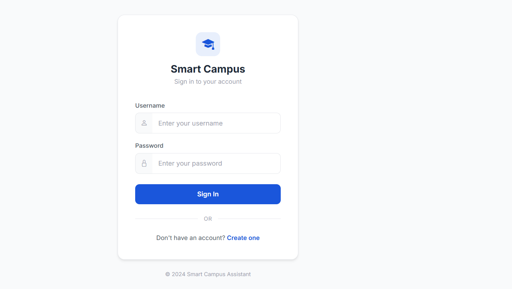

**Features**:
- Clean, modern login form
- Username and password fields
- "Remember Me" checkbox
- Link to registration page
- Error message display

**URL**: `/login`

---

### Registration Page
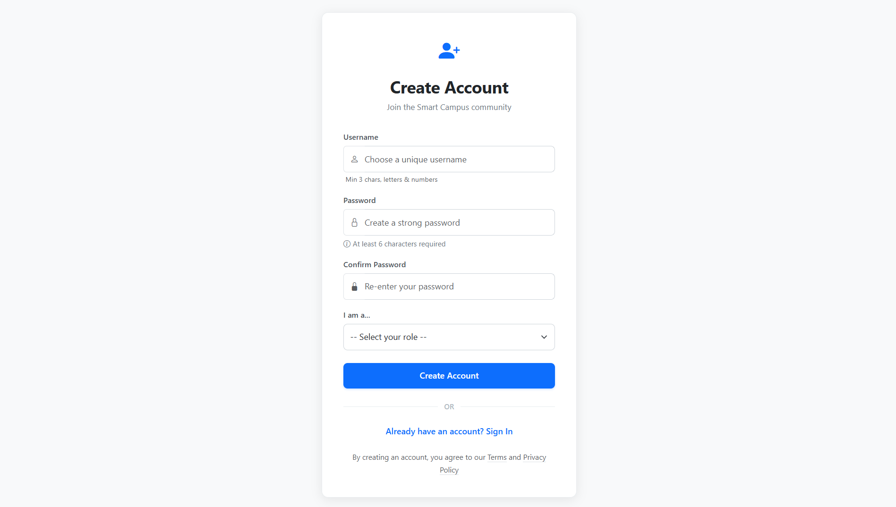

**Features**:
- User registration form
- Fields: Username, Password, Full Name, Email, Role
- Form validation
- Success message after registration

**URL**: `/signup`

---

## 📊 Student Interface

### Dashboard
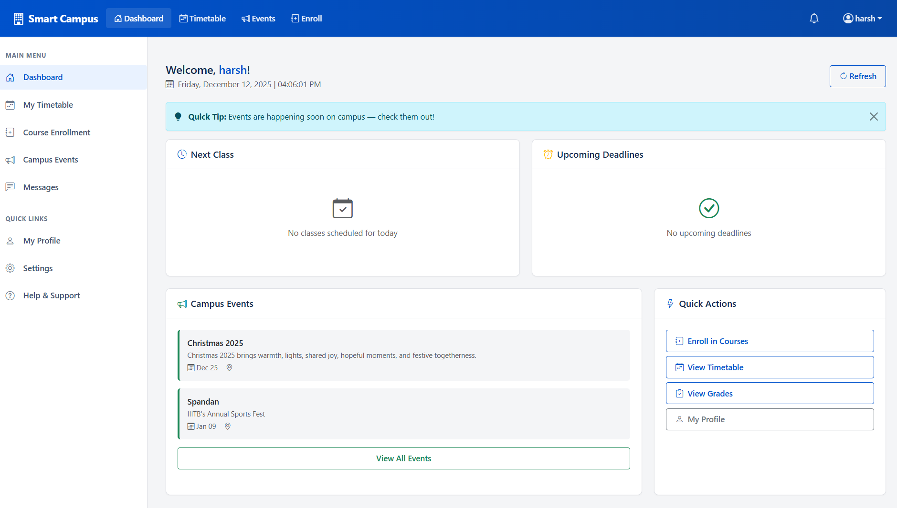

**Features**:
- Enrollment count card
- Today's classes count
- Upcoming events count
- Notifications count
- Today's schedule preview
- Next event card
- Quick action buttons

**URL**: `/dashboard`

---

### Weekly Timetable
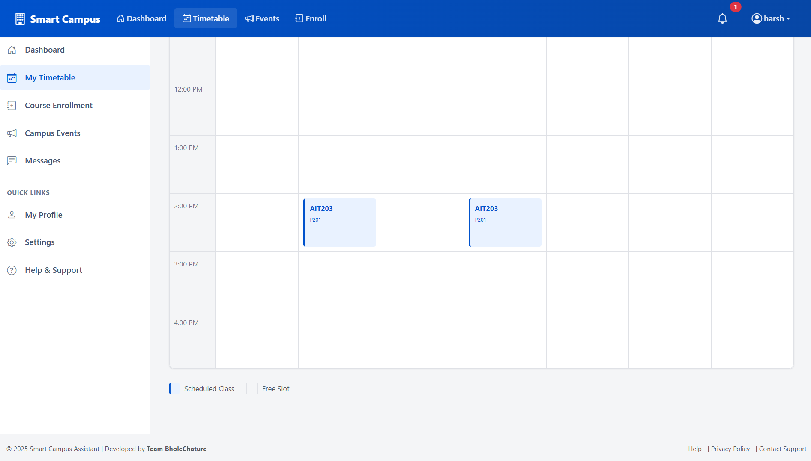

**Features**:
- Monday-Friday calendar view
- 9 AM - 5 PM time slots
- Color-coded class entries
- Course code, title, room number
- Responsive grid layout

**URL**: `/pages/timetable`

---

### Course Enrollment
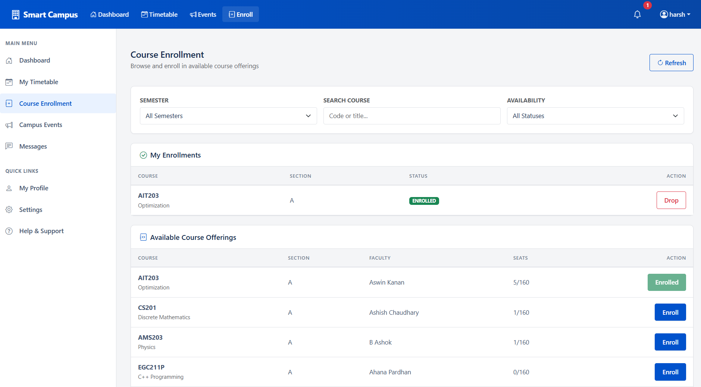

**Features**:
- Available course offerings list
- Course code, title, credits display
- Faculty name and department
- Enrolled/Max capacity indicator
- "Enroll" button
- My Enrollments section with "Drop" functionality

**URL**: `/pages/enroll`

---

### Campus Events
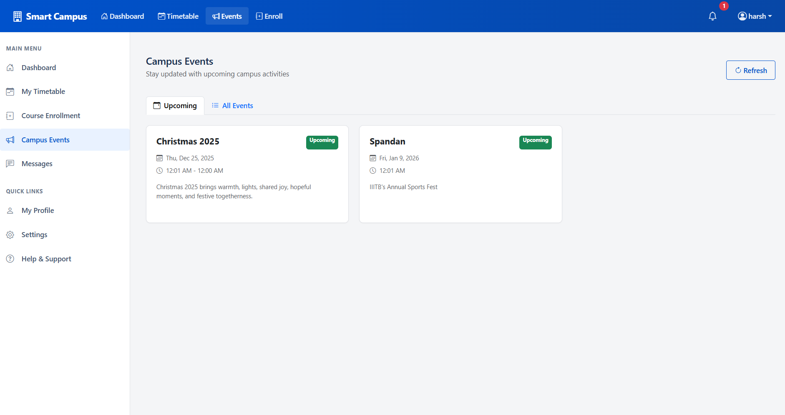

**Features**:
- Public events listing
- Event cards with title, date, venue
- "View More" modal for details
- Upcoming events section
- Filter by date/type

**URL**: `/pages/events`

---

### Profile Page
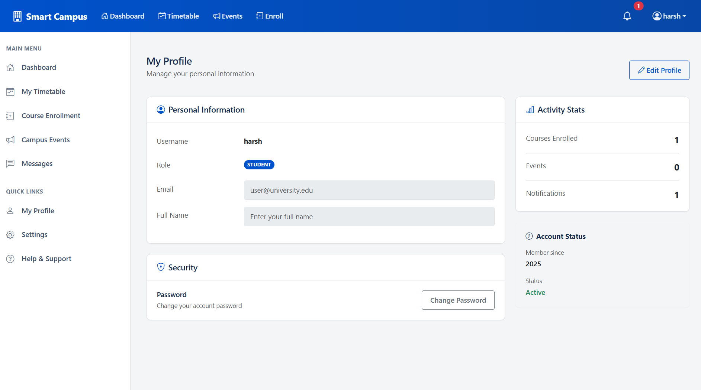

**Features**:
- User information display (username, email, full name, role)
- View profile details
- Navigation to settings and password change
- Account information overview

**URL**: `/pages/profile`

---

### Settings Page
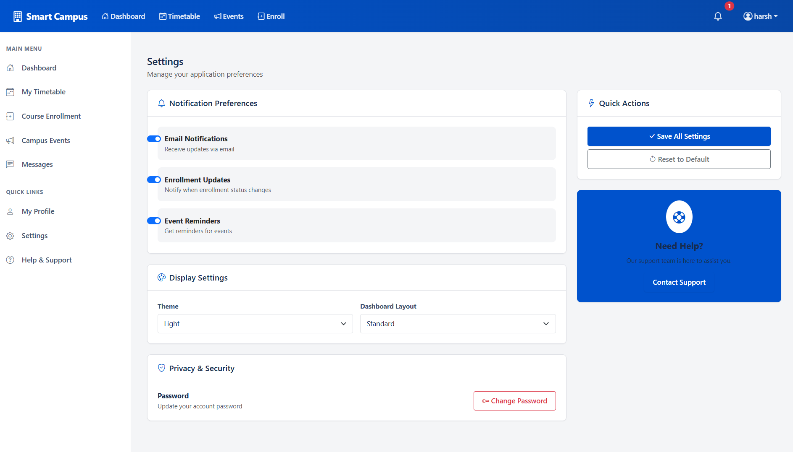

**Features**:
- Email notification preferences
- Account settings management
- Theme preferences
- Privacy settings
- Save/Cancel options

**URL**: `/pages/settings`

---

### Change Password
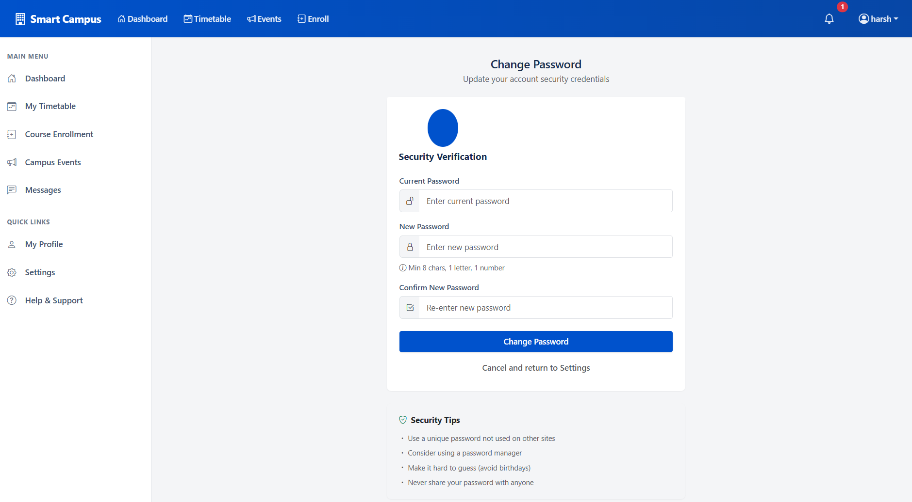

**Features**:
- Current password field
- New password field
- Confirm password field
- Password strength indicator
- Validation feedback
- Success/error messages

**URL**: `/pages/change-password`

---

### Notifications

**Features**:
- All notifications listing
- Notification cards with:
  - Title and message
  - Timestamp (relative time)
  - Read/Unread status indicator
- Mark as read functionality
- Delete notifications option
- Filter by read/unread status
- Real-time notification count

**URL**: `/pages/notifications`

---

## 🎛️ Admin Panel

### Admin Dashboard
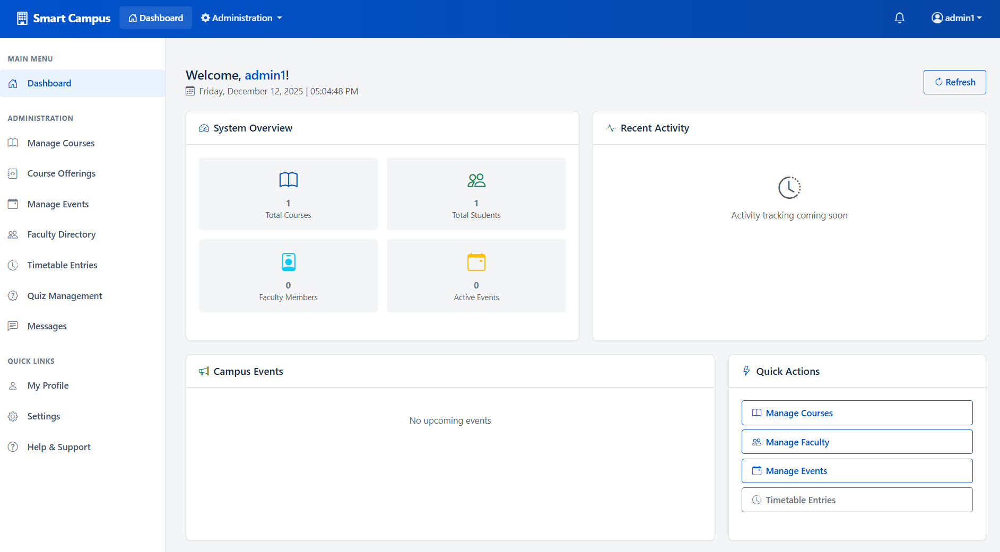

**Features**:
- System statistics
- Total users, courses, enrollments
- Recent activity log
- Quick action buttons

**URL**: `/admin/dashboard`

---

### Courses Management
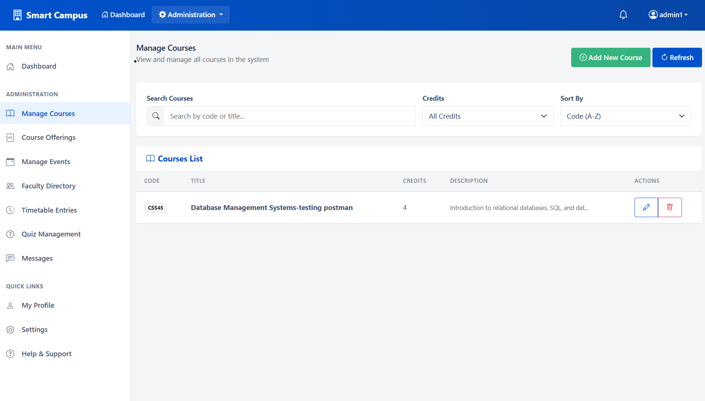

**Features**:
- All courses listing
- Search and filter
- Edit/Delete buttons
- "Add New Course" button

**URL**: `/admin/courses`

---

### Course Create/Edit
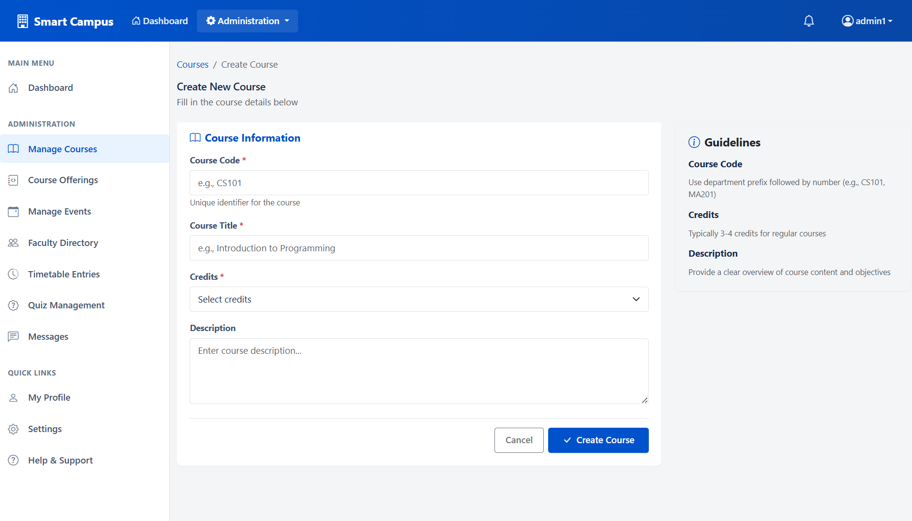

**Features**:
- Course form with fields:
  - Code, Title, Description
  - Credits, Department, Semester
- Validation feedback
- Save/Cancel buttons

**URL**: `/admin/courses/create`

---

### Faculty Management
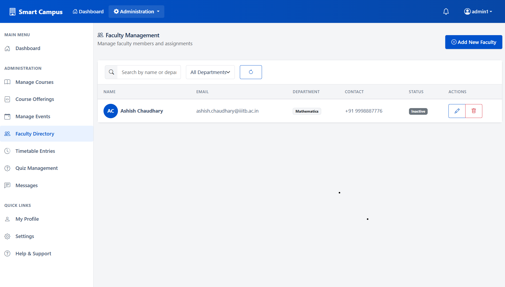

**Features**:
- Faculty directory
- Department filter
- Active/Inactive status indicator
- Contact information
- Edit/Delete actions

**URL**: `/admin/faculty`

---

### Faculty Create/Edit
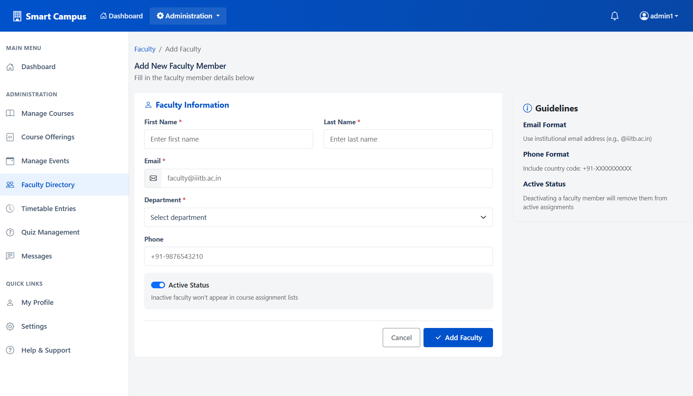

**Features**:
- Faculty form with fields:
  - First Name, Last Name
  - Email, Phone, Department
  - Cabin Number, Active Status
- Form validation

**URL**: `/admin/faculty/create`

---

### Course Offerings Management
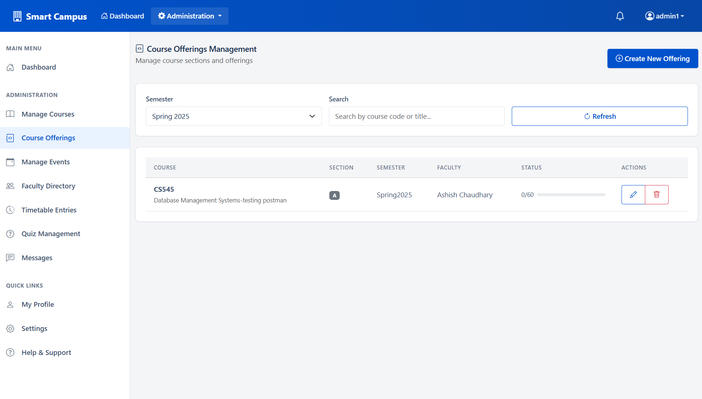

**Features**:
- Course offerings with:
  - Course code and title
  - Faculty name
  - Semester and year
  - Enrollment capacity (enrolled/max)
- Create/Edit/Delete actions

**URL**: `/admin/offerings`

---

### Offerings Create/Edit
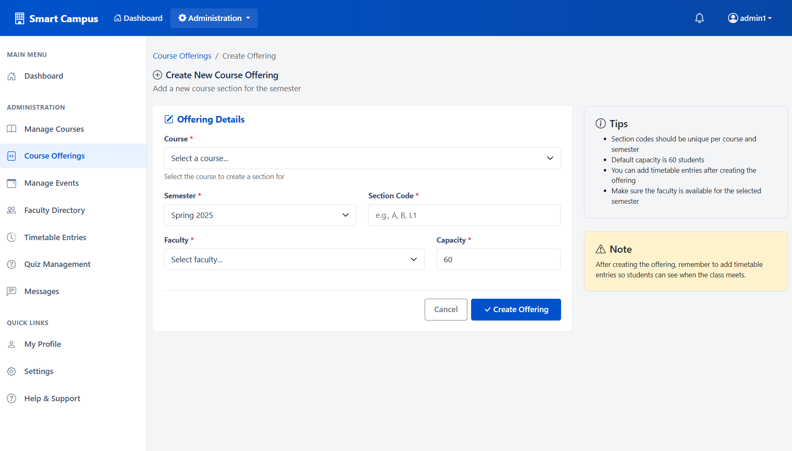

**Features**:
- Offering form with:
  - Course dropdown
  - Faculty dropdown
  - Semester, Year fields
  - Max Capacity input
- Linked to existing courses and faculty

**URL**: `/admin/offerings/create`

---

### Timetable Management
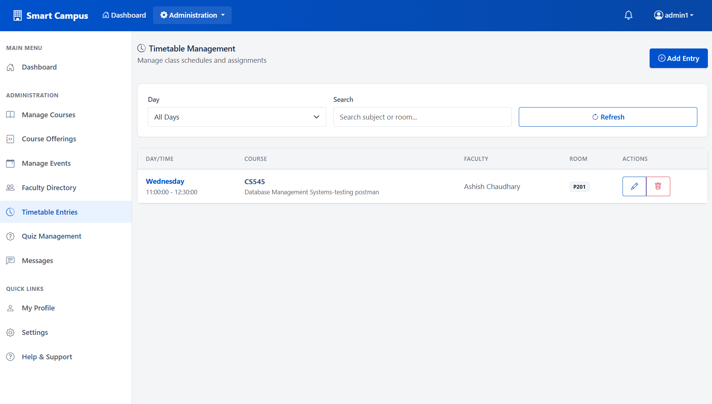

**Features**:
- All timetable entries listing
- Filter by day/course
- Day, Time, Room, Class Type display
- Create/Edit/Delete actions

**URL**: `/admin/timetable`

---

### Timetable Entry Create/Edit
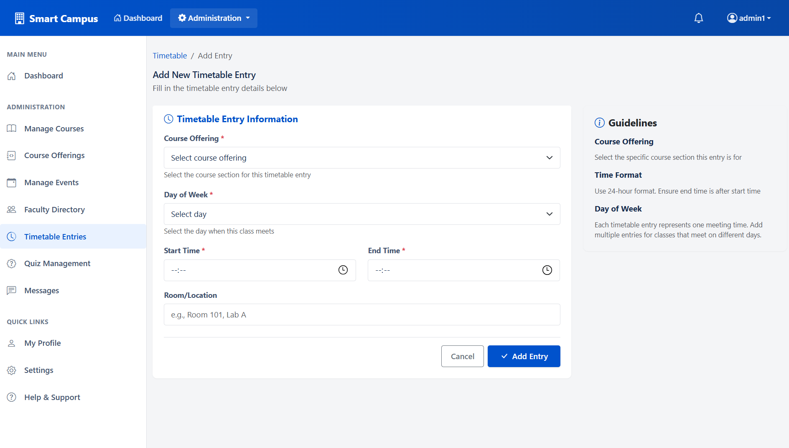

**Features**:
- Timetable form with:
  - Course Offering dropdown
  - Day of Week selector
  - Start/End Time pickers
  - Room Number input
  - Class Type (Lecture/Lab/Tutorial)

**URL**: `/admin/timetable/create`

---

### Events Management
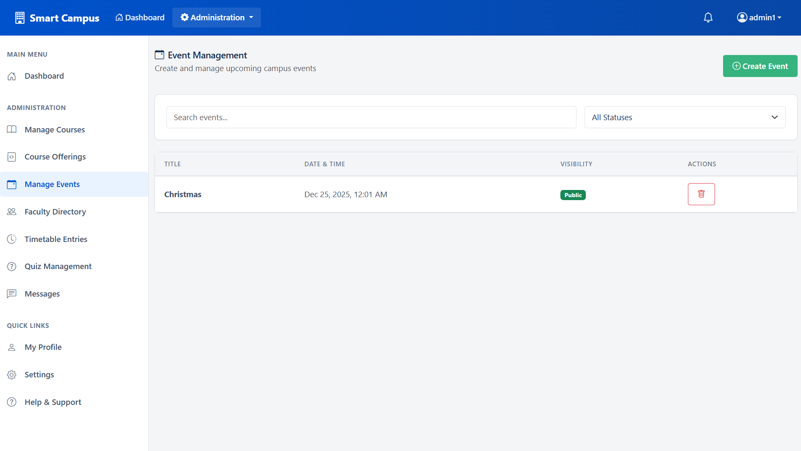

**Features**:
- All events (public + private) listing
- Event cards with visibility indicator
- Create/Edit/Delete actions
- Filter by date/visibility

**URL**: `/admin/events`

---

### Event Create/Edit
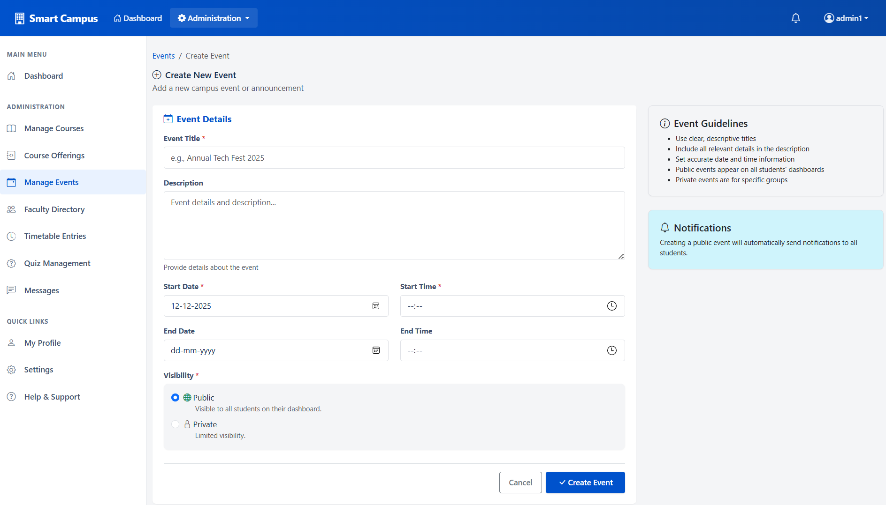

**Features**:
- Event form with:
  - Title, Description
  - Start/End DateTime pickers
  - Venue input
  - Public/Private toggle
- Date validation (future/present only)

**URL**: `/admin/events/create`

---

## 📝 Quiz Management System

### Quiz List (Admin)
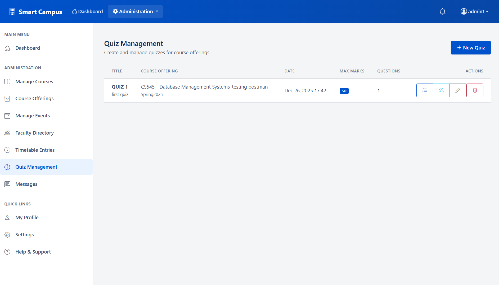

**Features**:
- All quizzes listing with:
  - Quiz title and course offering
  - Total questions count
  - Maximum marks
  - Duration in minutes
  - Active/Inactive status
- Create/Edit/Delete quiz actions
- View questions button
- Filter by course/status
- Sort by date/course

**URL**: `/admin/quizzes`

---

### Quiz Create
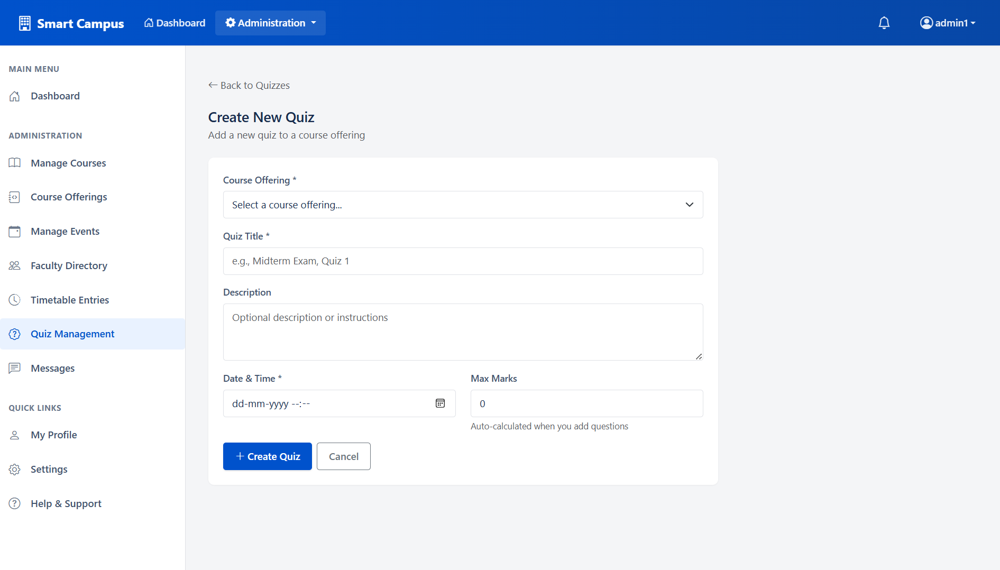

**Features**:
- Quiz creation form with:
  - Title input
  - Course Offering dropdown
  - Maximum marks input
  - Duration (minutes) input
  - Active status checkbox
- Form validation
- Save/Cancel buttons
- Link to add questions after creation

**URL**: `/admin/quizzes/create`

---

### Quiz Edit

**Features**:
- Edit existing quiz details
- Update title, marks, duration
- Change active status
- View associated questions
- Delete quiz option

**URL**: `/admin/quizzes/edit/{id}`

---

### Quiz Questions List

**Features**:
- All questions for selected quiz
- Question text display
- Question type indicator (MCQ/True-False/Short Answer)
- Points per question
- Order/sequence number
- Add/Edit/Delete question actions
- Reorder questions functionality

**URL**: `/admin/quizzes/{quizId}/questions`

---

### Question Create

**Features**:
- Question creation form with:
  - Question text (textarea)
  - Question type selector (MCQ/True-False/Short Answer)
  - Points input
  - Correct answer input
- MCQ-specific fields:
  - Option A, B, C, D inputs
  - Correct option selector
- Form validation
- Save/Cancel buttons

**URL**: `/admin/quizzes/{quizId}/questions/create`

---

### Question Edit

**Features**:
- Edit existing question
- Update question text, type, points
- Modify options (for MCQ)
- Change correct answer
- Delete question option

**URL**: `/admin/quizzes/{quizId}/questions/edit/{id}`

---

### Quiz Attempts List (Admin)

**Features**:
- All student attempts for quizzes
- Student name and quiz title
- Score and total marks
- Submission timestamp
- Filter by quiz/student
- View detailed responses
- Export results option

**URL**: `/admin/quizzes/attempts`

---

### Attempt Details (Admin)

**Features**:
- Student information
- Quiz details (title, max marks, duration)
- Question-by-question breakdown:
  - Question text
  - Student's answer
  - Correct answer
  - Points awarded/total
  - Correctness indicator
- Total score summary
- Time taken

**URL**: `/admin/quizzes/attempts/{attemptId}`

---

### Quiz Responses List (Admin)

**Features**:
- All individual responses
- Question text preview
- Student answer
- Correct answer comparison
- Points earned
- Filter by quiz/question/student
- Bulk grading options

**URL**: `/admin/quizzes/responses`

---

### Response Details (Admin)

**Features**:
- Full question display
- Student's complete answer
- Correct answer reference
- Manual grading interface (for short answers)
- Points adjustment
- Feedback text area
- Save grading button

**URL**: `/admin/quizzes/responses/{responseId}`

---

### Quiz Statistics (Admin)

**Features**:
- Overall quiz performance metrics:
  - Average score
  - Highest/Lowest scores
  - Total attempts
  - Completion rate
- Question-wise analytics:
  - Correct answer percentage
  - Most missed questions
  - Average points per question
- Score distribution chart
- Student performance ranking

**URL**: `/admin/quizzes/{quizId}/statistics`

---

### Course Quiz Dashboard (Admin)

**Features**:
- All quizzes for selected course
- Quiz performance overview
- Active/Inactive quiz count
- Total attempts summary
- Average scores by quiz
- Quick create quiz button

**URL**: `/admin/courses/{courseId}/quizzes`

---

### Student Progress Report (Admin)

**Features**:
- Individual student quiz history
- All attempted quizzes
- Scores and completion dates
- Progress trend chart
- Performance comparison with class average
- Download report button

**URL**: `/admin/students/{studentId}/quiz-progress`

---

### Quiz Settings (Admin)

**Features**:
- Global quiz configuration:
  - Default duration
  - Passing score percentage
  - Allow multiple attempts
  - Show correct answers after submission
  - Shuffle questions option
  - Randomize options option
- Save settings button

**URL**: `/admin/quizzes/settings`

---

### Bulk Quiz Operations (Admin)

**Features**:
- Select multiple quizzes
- Bulk activate/deactivate
- Bulk delete with confirmation
- Bulk export to CSV/Excel
- Duplicate quiz to another course
- Archive old quizzes

**URL**: `/admin/quizzes/bulk-operations`

---

### Quiz Template Library (Admin)

**Features**:
- Pre-built quiz templates
- Template categories (Midterm, Final, Practice)
- Preview template questions
- Clone template to course
- Create custom templates
- Share templates with other admins

**URL**: `/admin/quizzes/templates`

---

## 🎓 Student Quiz Interface

### Available Quizzes (Student)

**Features**:
- All active quizzes for enrolled courses
- Quiz cards showing:
  - Title and course name
  - Total questions and marks
  - Duration
  - Status (Not Started/In Progress/Completed)
  - Deadline (if applicable)
- "Start Quiz" button
- View previous attempts
- Filter by course/status

**URL**: `/student/quizzes`

---

### Quiz Taking Interface (Student)

**Features**:
- Question display with numbering
- Question navigation panel
- Answer input fields (based on question type):
  - Radio buttons for MCQ
  - Dropdown for True/False
  - Text area for Short Answer
- Timer countdown (real-time)
- Mark for review flag
- Previous/Next navigation buttons
- Submit quiz button
- Auto-save draft answers
- Warning before leaving page

**URL**: `/student/quizzes/{quizId}/take`

---

### Quiz Results (Student)

**Features**:
- Score display (earned/total marks)
- Percentage and grade
- Time taken
- Submission timestamp
- Question-by-question review:
  - Your answer
  - Correct answer (if enabled by admin)
  - Points earned per question
  - Correctness indicator (✓/✗)
- Feedback from instructor (if provided)
- Retake quiz button (if allowed)

**URL**: `/student/quizzes/results/{attemptId}`

---

## 💬 Messaging System

### Messages Inbox (Admin)

**Features**:
- All received messages listing
- Message preview cards with:
  - Sender name and role
  - Subject line
  - Message preview (first 50 chars)
  - Timestamp
  - Read/Unread indicator
- Compose new message button
- Reply/Delete actions
- Search messages
- Filter by sender/date/read status

**URL**: `/admin/messages`

---

### Sent Messages (Admin)

**Features**:
- All sent messages history
- Recipient information
- Sent timestamp
- Delivery status
- View message details
- Resend option (if failed)

**URL**: `/admin/messages/sent`

---

### Compose Message (Admin)

**Features**:
- Rich text editor for message body
- Recipient selector:
  - Individual users (autocomplete)
  - Entire course/section
  - All students/faculty
  - Custom groups
- Subject line input
- Priority level selector (Low/Normal/High/Urgent)
- Attachment upload (optional)
- Schedule send option
- Save as draft
- Send button with confirmation

**URL**: `/admin/messages/compose`

---

### Message Details (Admin)

**Features**:
- Full message display
- Sender/Recipient information
- Message thread/conversation view
- Attachments download
- Reply/Forward buttons
- Delete/Archive options
- Mark as unread option

**URL**: `/admin/messages/{messageId}`

---

### Broadcast Messages (Admin)

**Features**:
- Send to multiple recipients
- Target audience selector:
  - All students
  - Specific courses
  - By enrollment year
  - By department
  - Faculty only
- Announcement template options
- Preview before sending
- Scheduled broadcast
- Track delivery and read status

**URL**: `/admin/messages/broadcast`

---

### Message Templates (Admin)

**Features**:
- Pre-saved message templates
- Template categories (Welcome, Reminder, Announcement)
- Quick insert placeholders (Student Name, Course, Date)
- Create/Edit/Delete templates
- Use template button

**URL**: `/admin/messages/templates`

---

### Message Analytics (Admin)

**Features**:
- Messages sent/received statistics
- Read rate percentage
- Response time metrics
- Most active users
- Peak messaging hours
- Filter by date range

**URL**: `/admin/messages/analytics`

---

## 💬 Student Messaging Interface

### Messages Inbox (Student)

**Features**:
- All received messages from faculty/admin
- Message cards with:
  - Sender name
  - Subject
  - Preview text
  - Timestamp
  - Read/Unread status
- Compose message to faculty
- Reply/Delete actions
- Search functionality
- Archive old messages

**URL**: `/student/messages`

---

### Sent Messages (Student)

**Features**:
- Sent messages history
- Recipient (faculty) information
- Sent timestamp
- View message details

**URL**: `/student/messages/sent`

---

### Compose Message (Student)

**Features**:
- Recipient selector (enrolled course faculty only)
- Subject line
- Message body (text area)
- Attachment option
- Send/Cancel buttons
- Character count indicator

**URL**: `/student/messages/compose`

---

### Message Details (Student)

**Features**:
- Full message content
- Sender information
- Timestamp
- Reply button
- Download attachments
- Delete message option

**URL**: `/student/messages/{messageId}`

---

### Message Notifications (Student)

**Features**:
- Real-time notification badge
- Unread message count
- Toast notification on new message
- Direct link to inbox
- Mark all as read option

**URL**: Notification badge appears on all pages

---

## 📱 Responsive Design

### Mobile View - Dashboard

**Features**:
- Responsive cards stack vertically
- Touch-friendly buttons
- Optimized for small screens

---

### Mobile View - Timetable

**Features**:
- Horizontal scroll for time slots
- Swipe navigation
- Compact view

---

## 🎨 UI Components

### Toast Notifications

**Types**:
- Success (green)
- Error (red)
- Info (blue)
- Warning (orange)

---

### Modal Dialogs

**Features**:
- Event details modal
- Confirmation dialogs
- Form modals

---

## 🖼️ Adding Screenshots

To add new screenshots:

1. Take screenshot of the page
2. Save as PNG with descriptive name
3. Place in `docs/screens/` folder
4. Add entry to this document with:
   - Page title
   - Screenshot image link
   - Features list
   - URL

**Screenshot Naming Convention**:
- `login.png` - Login page
- `dashboard.png` - Student dashboard
- `admin-courses.png` - Admin courses page
- `mobile-dashboard.png` - Mobile view

---

## 📝 Notes

**Placeholder Screenshots**: Some screenshots may be placeholders until actual UI is captured.

**High-Resolution**: All screenshots should be high-resolution (1920x1080 or higher) for clarity.

**Privacy**: Remove any sensitive data (real names, emails, passwords) before adding screenshots.

---

**Last Updated**: December 12, 2024  
**Maintained by**: Team BholeChature

---

## 📊 Feature Coverage Summary

**Authentication**: 3 endpoints (Login, Signup, Logout)  
**Student Features**: 27 page routes (Dashboard, Timetable, Enrollment, Events, Profile, Settings, Change Password, Notifications, Quizzes, Messages)  
**Admin Features**: 49 page routes (Courses, Faculty, Offerings, Timetable, Events, Quizzes, Messages)  
**REST APIs**: 63 endpoints  
**Total**: 115 endpoints fully documented with screenshots

**Module Breakdown**:
- Authentication: 2 pages
- Dashboard: 1 page
- Timetable: 5 pages (1 student + 4 admin)
- Enrollment: 1 page
- Events: 3 pages (1 student + 2 admin)
- Courses: 2 admin pages
- Faculty: 2 admin pages
- Offerings: 2 admin pages
- Profile/Settings: 3 pages
- Notifications: 1 page
- Quizzes: 18 pages (2 student + 16 admin)
- Messages: 12 pages (5 student + 7 admin)

**Technology Stack**: Spring Boot 3.4.12 • Java 24 • Thymeleaf • MySQL 8.0 • Bootstrap 5
